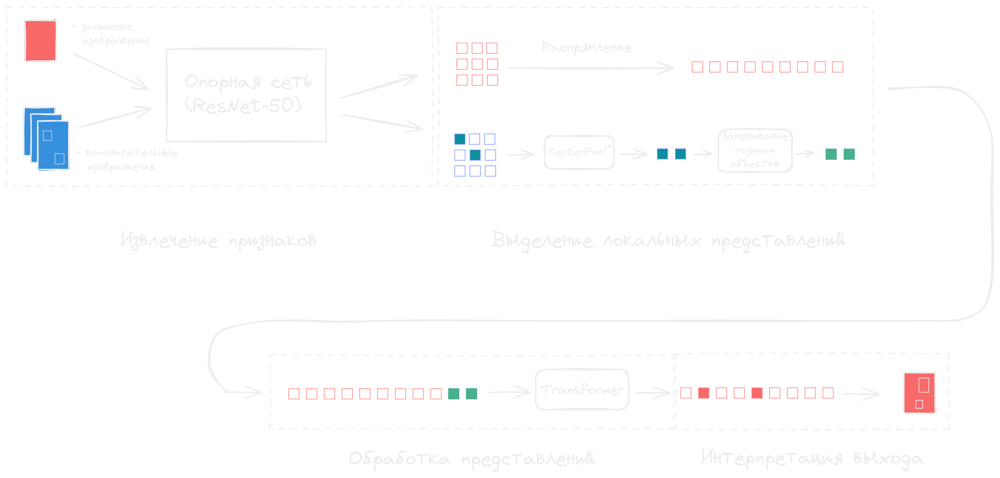
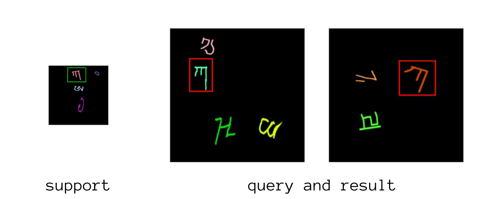
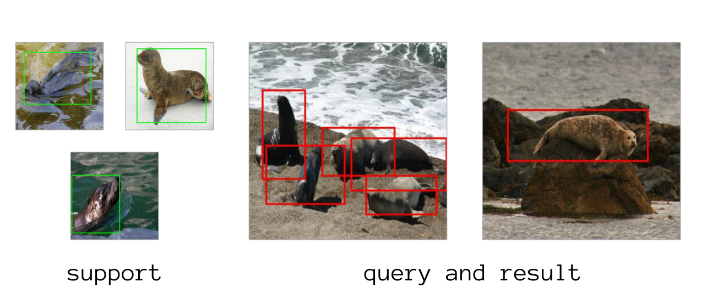

# Few-Shot Object Detection

## Description

In this project, the challenge of detecting objects from new categories without fine-tuning and in conditions of minimal labeled data was addressed.

  

To tackle this, a simple yet effective model architecture was proposed. It comprises two main components — a fully convolutional neural network extracting feature descriptions and a transformer-based model associating information from several annotated examples with the extracted representations for making predictions. 

  

The proposed model leverages information from multiple annotated examples and performs one-stage detection. The model was trained and evaluated both on a custom synthetic dataset and FSOD dataset.

  
  

## Contributors 
This project was completed by [Stanislav Mikhaylevskiy](https://github.com/lqrhy3) and [Vladimir Chernyavskiy](https://github.com/JJBT). If you have any questions or suggestions regarding this project, please feel free to contact us.
